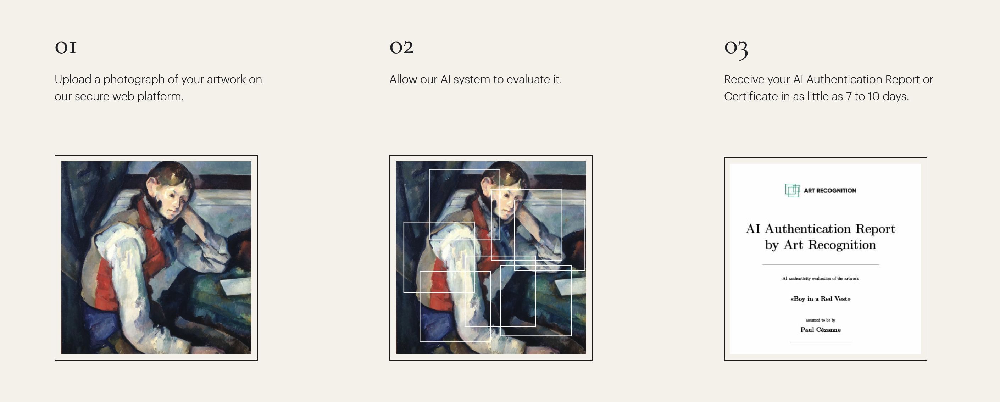
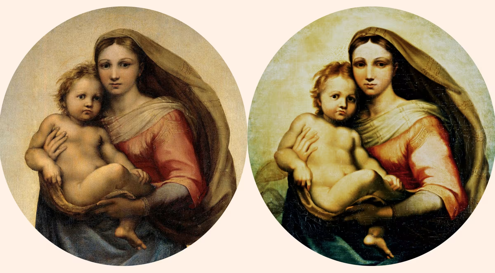

*Изначально опубликовано в [Telegraph](https://telegra.ph/EHpopeya-dvuh-AI-Iskusstvo-Intriga-i-Tehnologii-03-15). Обложка создана с использованием образов, сгенерированных Шедеврумом и DALL-E 2.*

---

Привет!

Я Юля Афлетунова и я уже больше 5 лет занимаюсь анализом данных в широком смысле. Я начинала работу в качестве менеджера разработки продукта с использованием AI, успела побыть ML инженером и уже почти 4 года фокусирую свое внимание на продуктовой стороне анализа данных.

Осенью мне в голову пришла идея сделать нейронку, которая будет по картине определять авторство произведения. И, разумеется, я пошла изучать уже существующие решения. И так я наткнулась на одну очень интересную историю.

Начнем с того, что в целом идентификацией оригинальности картин занимаются немногие. В первую очередь потому, что определить авторство картины сложно, хотя бы из-за того, что даже человек-эксперт с многолетним опытом часто не может наверняка сказать, является ли картина оригинальной или нет. Необходимо проводить множество тестов (изучать материалы, из которых сделано полотно, делать рентген картины, проводить лабораторные тесты, и многое другое) помимо детального визуального исследования. Текстуры, глубина мазка, чего только нет в нашем недвумерном мире, что помогает определить авторство работы. И трудно на одном только визуале понять, кто же нарисовал тот или иной шедевр. Более того, нельзя сказать об авторстве однозначно, не изучая другие картины того же художника.

Поэтому существуют такие агентства, как [Art Recognition](https://www.art-recognition.com/). Art Recognition как раз одни из немногих, кто взял на себя задачу верификации подлинности произведений искусства с помощью искусственного интеллекта. Здесь важно слово «помощь», потому что только технологиями искусственного интеллекта, насколько мне известно, они не ограничиваются. Они делают это очень красиво — посмотрите на пример их отчёта на сайте. Там также есть довольно увлекательные исследовательские работы, рекомендую.

И вот новости из мира искусственного интеллекта, которые меня волнуют уже полгода, словно мне опять 16, и я урывками читаю роман Дэна Брауна.

---

**Январь 2023 года.** На сайте университета Ноттингема появилась статья о том, что картина неизвестного автора, известная под именем Тондо де Бреси, по результатам исследований группы из Ноттингемского университета и Университета Брэдфорда, вероятно, была создана одним и тем же художником, что и Сикстинская Мадонна. То есть знаменитым художником эпохи Высокого Возрождения, Рафаэлем Санти. Открытие, скажем честно, поразительное. И дорогое.

Дальше пара деталей о том, как проводилось это исследование. Во-первых, картина Тондо де Бреси в мире искусства изучается давно и со всех сторон. Для невооружённого глаза, это действительно две практически одинаковые работы. Но эксперты около 40 лет спорили и не могли прийти к единому мнению о том, написана ли эта работа великим художником или является копией, созданной в примерно тот же период. И вот, в январе мир узнаёт о том, что нейронная сеть, разработанная группой профессора Хассана Угайла, показала, что Мадонна совпадает с оригиналом с 97%-ным сходством, в то время как Младенец — с 86%-ным.

**Июль 2023 года.** Картину выставили в Художественной галерее Картрайт-холл в Брэдфорде, Великобритания. Это было довольно значимым событием.

**Октябрь 2023 года.** Выходит статья с заголовком «Битва ИИ: конкурирующие технические команды спорят о том, кто нарисовал "Рафаэля" в британской галерее». Как это принято в новостных заголовках, «битва» — это некоторое преувеличение в данной ситуации, как и конкуренция между командами. Но вопрос действительно интересный и интригующий. Дело в том, что в это же время Art Recognition в лице своего CEO, доктора Карины Поповичи, проводит отдельное исследование с помощью AI и выявляет, что картина с вероятностью в 85% нарисована не Рафаэлем.

В чём же разница между двумя моделями? Об этом Карина Поповичи пытается рассказать в ещё одной публикации. Дело в том, что DNN, используемая группой из университета Брэдфорда, основана на распознавании лиц. Но, как я уже упоминала, визуальной информации может быть недостаточно для определения авторства картины. Поэтому в Art Recognition используются курируемые историками и разработчиками AI датасеты, дополненные информацией о мазках и хроматике, то есть богатстве красок, произведения. Более того, свои датасеты они наполняют большим количеством копий, имитаций и даже фейков, созданных другими AI.

Карина Поповичи в своей статье призывает обратить внимание на то, что AI можно использовать в качестве полезного инструмента для обогащения художественной экспертизы, не противопоставляя свою разработку разработке коллег. Помимо этого, она добавляет, что группе из университета Брэдфорда ещё предстоит построить связь между метрикой сходства лицевых черт и подлинностью произведения, и надеется, что статья её коллеги, профессора Хассана Угайла, внесёт необходимую ясность в этот вопрос.

**Декабрь 2023 года.** Наконец-то в Springer выходит работа под названием «Deep transfer learning for visual analysis and attribution of paintings by Raphael» авторства профессора Хассана Угайла и его коллег. Коротко: они извлекли признаки с помощью предобученной модели ResNet50 и использовали SVM для дальнейшей классификации (подлинник или нет). Но сверх того, они использовали разные методы детекции граней для оценки стиля и авторства. Звучит уже ближе к тому, о чём говорилось в статье доктора Карины Поповичи.

**Начало марта 2024 года.** Financial Times выпускают новую главу этой истории. Здесь и группа Угайла, и агентство Поповичи приходят к общему выводу о том, что на данном этапе AI не заменяет экспертизу человека и упускает какие-то детали, которые мы пока можем наблюдать только будучи людьми. При этом Угайл замечает, что метод, предложенный Поповичи, не единственно верен, и можно разрабатывать другие методы проверки подлинности произведений искусства. Но они всё ещё не могут заменить человека. Как ни человек, ни AI не могут однозначно определить авторство работы. И все эксперты с этим согласны.

---

От себя хочу сказать, что таких историй будет становиться больше, и это меня однозначно радует. Меня точно не пугает то, как сильно искусственный интеллект входит в нашу жизнь, работу, обучение. Я вижу окно возможности для того, чтобы расширить свою область деятельности путём изучения новых технологий и методов. Как для меня лично, так и для индустрии в целом.

А как часто вы думаете о том, где ещё можно применить современные технологии?
