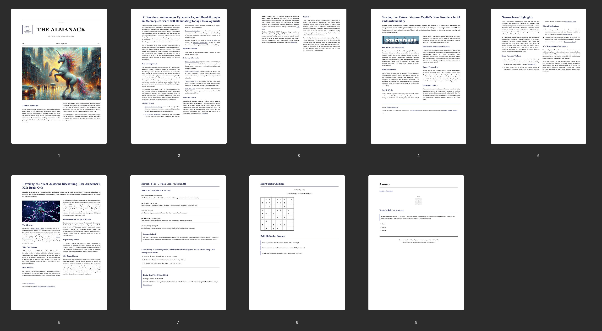

Three weeks ago, I found an interesting position at n8n. The job description has prompted me, like any other candidate, to try and play with the actual product before applying. 

As I am not in a rush and I am trying to choose my team and job wisely, as I choose my life partners, I took a couple of days to think about it (in today's market, this is not the best idea if you want to actually land the job). 

So, after almost a week, I decided to actually try n8n. And oh my, my chronic data scraper fell in love. 

I did try to use some No-Code solutions before, mostly for my other endeavours, while trying to optimise my workflows, especially before the AI era. However, my main experience working with a similar product comes from Yandex, where I set up some complex tasks using Nirvana. It was something, and I can't say I liked this experience. 

Nevertheless, n8n changed my perspective here. As I said, part of me has always loved collecting and organising information (hence I am writing this post right now in Obsidian). The part of data collection in the current era is data scraping. You love a good data scraping, right? And platforms hate when you do this using your optimisations and agents.

The safe ground for many --- RSS. Platforms willingly share their news and articles; scrapers feed those XMLs and JSONs into their pipelines. Everyone is happy, no one is really offended. But then you meet someone who wrote some messy website, but shares very valuable information you need to fetch automatically and constantly. And of course, they have no API, nor RSS feed. Before, you used to take a deep breath, open your editor, and start figuring out how to scrape this one table from the messy hierarchy built on optimisations and trade-offs. It breaks; you need to find and debug this in your code, and if you didn't write proper observability and maintenance---you are practically fucked for at least a couple of hours. 

And here come those wonderful and easy-to-use n8n nodes. I had so much pleasure today collecting various news sources and articles to gather fresh, useful info on topics of my interest. But well, a simple RSS about GDPR, AI Act and some AI Safety news was not enough for me, so I summarised those daily findings, added a weather widget, played with design a bit, and vibe-coded me a news-leaflet. 

I genuinely had so much fun working on this, so I decided that I won't stop and actually finally find a way to feed my mind with news and ideas every day, while keeping myself away from ads, social interactions, and any other attention-seeking funnels everyone is trying to catch you in. 

I am creating my own newspaper. I added a Neuroscience Section, two comprehensive articles to dive deep into, and how one newspaper can even exist without some puzzles---I am adding Sudoku at the end of each issue. 

Some German too, maybe? My goal for this year is to get a language certificate, so you'll be witnessing my experiments with exercises and useful bits of knowledge here and there.

This is how the newspaper evolved from the first iteration to the issues I actually read daily. 

And starting from today, you can find a daily issue here on my blog; just click [The Almanack](https://afletunova.me/the-almanack/) at the top of the page. 